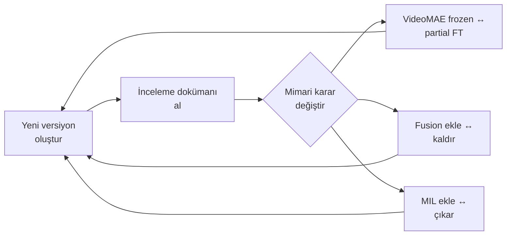

# 🐄 CowLameness Projesi — Kapsamlı Analiz Raporu

**Tarih:** 2026-02-13
**Analiz Kapsamı:** Tüm proje dosyaları, 14 notebook versiyonu (v18–v31), 16 inceleme dokümanı, helper modüller, lokal işleme scriptleri, DeepLabCut çıktıları

---

## 1. PROJENİN AMACI (Ne Yapmaya Çalışıyorsun?)

Projenin temel amacı:

> **Video kayıtlarından, ineklerde topallık (lameness) şiddetini ordinal olarak (0–3 skalasında), klinik olarak anlamlı, genellenebilir ve akademik olarak savunulabilir biçimde otomatik tahmin etmek.**

Bu amaç şu zorunlu bileşenleri içerir:

| Bileşen | Açıklama |
|---------|----------|
| **Hareket temelli analiz** | Statik görünüm yetmez; yürüyüş bozukluğu zamansal bir fenomendir |
| **Biyomekanik sinyaller** | Head bob, spine angle, stride asymmetry, step frequency |
| **Ordinal çıktı** | 0–3 arası klinik şiddet skalası (CORAL loss) |
| **Subject-level genelleme** | Aynı inek train ve test'te bulunmamalı |
| **Hibrit mimari** | Lokal pose estimation (DLC/MMPose) + Bulut analiz (Colab) |

---

## 2. MEVCUT PROJE DURUMU

### 2.1 Proje Yapısı

```
CowLameness/
├── DeepLabCut/          → Lokal pose estimation (SuperAnimal-Quadruped)
├── MMPose/              → Lokal pose estimation (AP10K)
├── DeepLabCutOutputs/   → 1167 DLC çıktısı (outputs/ alt klasörü)  ✅
├── sync/                → Drive senkronizasyon scripti
├── Colab_Notebook/      → 14 notebook + 23 helper dosya
├── talimatlar/          → 16 inceleme/analiz dokümanı
├── md_files_for_project/→ Literatür notları
├── config.yaml          → Proje konfigürasyonu
└── README.md            → İki dilli proje dokümanı
```

### 2.2 Versiyon Geçmişi Özeti

| Versiyon Aralığı | Ana Odak | Durum |
|-------------------|----------|-------|
| **v18–v20** | İlk pipeline, temel kurulum | Terk edildi |
| **v21–v24** | Multi-modal fusion (Pose+Flow+VideoMAE), gold standard pipeline | Aşırı karmaşık, fusion gerekçelendirilmemiş |
| **v25** | Fusion + VideoMAE + Temporal Transformer | Fusion kaldırılma kararı alındı |
| **v26–v27** | VideoMAE frozen, clip-level architecture, fusion kaldırıldı | Doğru yönde adımlar |
| **v28–v29** | Akademik güçlendirme, assertion'lar, subject-level split | Skor düşük ama bilimsel olarak daha sağlam |
| **v30** | VideoMAE partial fine-tuning geri döndü, MIL + Temporal Transformer | Mimari regresyon — inceleme11'de reddedildi |
| **v31** | inceleme11 doğrultusunda pose-guided düzeltme denemesi | Son versiyon, henüz eğitilmemiş durumda |

### 2.3 Tamamlanan İşler

| İş | Durum |
|----|-------|
| DeepLabCut SuperAnimal çıktıları (1167 video) | ✅ Tamamlandı |
| Lokal DLC/MMPose processing scriptleri | ✅ Çalışır durumda |
| Drive senkronizasyon scripti | ✅ Yazıldı |
| Temel notebook pipeline (VideoMAE → Temporal → CORAL) | ⚠️ Var ama stabil değil |
| Gait feature extraction modülü (gait_features.py) | ⚠️ Yazıldı ama notebook'ta kullanılmıyor |
| README ve dokümanlar | ✅ |

---

## 3. KRİTİK HATALAR VE SORUNLAR

### 3.1 📐 Mimari Sorunlar

#### ❌ A) VideoMAE Stratejisi — Sürümler Arası Çelişki

Bu projenin **en tekrarlayan ve çözülmemiş sorunu.**

```
v26–v27: "VideoMAE tamamen frozen olmalı!" → Doğru karar
v28–v29: "Frozen devam" → Skor düşük ama dürüst
v30:     "Partial fine-tuning geri döndü!" → Mimari regresyon
v31:     "Frozen'a dönülmeli" → inceleme11'de uyarıldı
```

**Sorunun Kökeni:** VideoMAE insan aksiyonları üzerine eğitilmiş (Kinetics-400). İnek yürüyüşüne domain gap büyük. Frozen bırakıldığında skor düşük; fine-tune edildiğinde dataset artefact'lerini öğrenme riski yüksek.

> [!WARNING]
> Her sürüm değişikliğinde bu karar yeniden alınıyor. Net bir ADR (Architecture Decision Record) yazılıp sabitlenememiş.

---

#### ❌ B) MIL Attention + Temporal Transformer Redundansı

[v30_gold_standard_model.py](file:///c:/Users/HP/Desktop/Clone%20Repos/CowLameness/Colab_Notebook/v30_gold_standard_model.py) dosyasında:

```
Video → Clips → VideoMAE → Temporal Transformer → MIL Attention → CORAL
```

**Problem:** Temporal Transformer zaten sequence reasoning yapıyor. Üzerine MIL Attention eklemek:
- Gradient akışını bozar
- Attention'lar birbiriyle rekabet eder
- Akademik gerekçesi yok, ablation yapılmamış

**inceleme11 teşhisi:** *"The architectural redundancy between temporal attention and MIL is not justified."*

---

#### ❌ C) Pose Verisi Çıkarılmış ama Modele Sokulmuyor

**Bu projenin en büyük paradoksu.**

- 1167 video için DeepLabCut çıktıları üretilmiş ✅
- [gait_features.py](file:///c:/Users/HP/Desktop/Clone%20Repos/CowLameness/Colab_Notebook/gait_features.py) modülü yazılmış ✅ (head bob, stride asymmetry, hip sway, joint angles)
- **Ama hiçbir notebook sürümünde (v26–v31) bu bilgi modele girmiyor** ❌

Bu durumda:
- DeepLabCut çıktıları anlamsız kalıyor
- Model biyomekaniğe değil, RGB texture/kamera açısı/siluet gibi sinyallere bakıyor
- Hakem *"Why was pose information excluded?"* sorusuna cevap yok

---

#### ❌ D) Çoklu Tutarsız Modül Dosyaları

[Colab_Notebook/](file:///c:/Users/HP/Desktop/Clone%20Repos/CowLameness/Colab_Notebook/) klasöründe birbirleriyle **çelişen** modül implementasyonları:

| Dosya | Ne Yapıyor | Çelişki |
|-------|-----------|---------|
| `videomae_encoder.py` | Blocks 9-11 trainable (partial FT) | v31 frozen istiyor |
| `v30_gold_standard_model.py` | VideoMAE frozen + MIL Attention | inceleme11 MIL'i reddediyor |
| `lameness_model.py` | Multi-modal fusion (Pose+Flow+VideoMAE) | v26'dan beri fusion kaldırılmış olmalıydı |
| `gold_standard_pipeline.py` | Tüm modülleri entegre eder | Hangi versiyon geçerli belirsiz |
| `causal_transformer.py` | DomainNorm + MIL + SSL pretraining | Hiçbir notebook'ta kullanılmıyor |

> [!CAUTION]
> **Hangi dosyanın "geçerli" ve "aktif" olduğu belli değil.** Bu, hem geliştirme hem de akademik reproduksiyon için kritik bir risk.

---

### 3.2 📊 Akademik Sorunlar

#### ❌ E) Label Mapping — Binary Olarak Kullanılan Ordinal Sistem

[analiz00.md](file:///c:/Users/HP/Desktop/Clone%20Repos/CowLameness/talimatlar/analiz00.md) teşhisi:

```python
all_labels = [0]*len(healthy_videos) + [3]*len(lame_videos)
# Ordinal 0–3 tanımlanmış ama sadece 0 ve 3 kullanılıyor
```

**Etkileri:**
- CORAL loss'un ordinal avantajı tamamen kaybolur
- Model ara seviyeleri (Grade 1, 2) hiç görmez
- Fiilen binary sınıflandırmaya eşdeğer
- Çıkarım sırasında Grade 1 veya 2 tahmin etmesi anlamsız

**Kök Neden:** Veri setinde sadece "Sağlıklı" (klasör) ve "Topal" (klasör) var. Ara derecelendirme yok.

---

#### ❌ F) Eksik Akademik Bileşenler

| Eksik | Neden Kritik |
|-------|-------------|
| **Baseline karşılaştırması** | Random classifier, majority class, ResNet+LSTM gibi en az 3 baseline şart |
| **Cross-validation** | Tek train/test split yerine 5-fold CV |
| **İstatistiksel testler** | t-test, McNemar, bootstrap CI |
| **Ablation study** | Her bileşenin ayrı katkısının kanıtlanması |
| **Quadratic Weighted Kappa** | Ordinal sınıflandırma için standart metrik |
| **Explainability** | Modelin neye baktığının kanıtı (SHAP, attention heatmap) |

---

#### ❌ G) Klinik Bağlantı Zayıf

Model şu anda fiilen çözdüğü problem:

> *"Bu video, veri setindeki diğer videolara göre daha anormal."*

Çözmesi gereken:

> *"Bu ineğin yürüyüş döngüsündeki bozukluk, klinik olarak Grade-X topallığa karşılık gelmektedir."*

Periyodiklik (adım döngüsü), asimetri (sol-sağ), stride bozukluğu modelin yapısında temsil edilmiyor.

---

### 3.3 🔧 Kod Kalitesi Sorunları

#### ❌ H) Error Handling Eksikliği

Video okuma, CSV parsing, GPU bellek yönetimi gibi kritik noktalarda try-except yok.

#### ❌ I) Early Stopping ve LR Scheduler Yok

30 epoch sabit eğitim → overfitting riski yüksek.

#### ❌ J) Logging ve Config Validation

`print` yerine proper logging kullanılmıyor; config dictionary'leri validation'sız.

---

### 3.4 📁 Proje Yönetimi Sorunları

#### ❌ K) 14 Notebook Sürümü Yönetilemiyor

Hiçbir sürüm silinmemiş, hangisinin "geçerli" olduğu belirsiz. README hâlâ v18'i referans gösteriyor.

#### ❌ L) 23 Helper Script — Aktif Pasif Ayırımı Yok

`add_v22_fixes.py`, `create_v22_notebook.py`, `fix_colab_error.py` gibi tek seferlik scriptler hâlâ dizinde duruyor.

#### ❌ M) config.yaml ile Notebook Config Uyumsuzluğu

[config.yaml](file:///c:/Users/HP/Desktop/Clone%20Repos/CowLameness/config.yaml):
- `optical_flow: true`, `sam_segmentation: true`, `yolo_detection: true`
- Bunların hiçbiri son notebook sürümlerinde kullanılmıyor

#### ❌ N) README Güncel Değil

- README hâlâ v18'i referans gösteriyor (satır 80, 203)
- Pipeline açıklaması "169 biomechanical features" vs son durumla uyumsuz
- Beklenen performans değerleri henüz doldurulmamış

---

## 4. TEKRARLAYAN HATA PATERNLERİ

Proje geçmişinde **döngüsel bir pattern** mevcut:



**Her döngüde:**
1. Yeni notebook versiyonu oluşturuluyor
2. Uzman incelemesi kritik hatalar buluyor
3. Mimari karar değiştiriliyor
4. Ama önceki kararın neden alındığı **yazılı olarak sabitlenmemiyor**
5. 2-3 versiyon sonra eski karar geri gelebiliyor (ör: partial FT)

> [!IMPORTANT]
> Bu döngüyü kırmak için: **sabitlenmiş bir mimari kararlar dokümanı (ADR)** ve **tek geçerli notebook** gerekiyor.

---

## 5. DOĞRU YAPILANLAR (Korunması Gerekenler)

| Alan | Değerlendirme |
|------|---------------|
| **Subject-level split** | ✅ animal_id bazlı, assertion ile doğrulanmış |
| **Temporal ordering** | ✅ Frame/clip sıralaması korunuyor |
| **CORAL ordinal regression** | ✅ K-1 sigmoid + BCE mantığı doğru |
| **Determinism** | ✅ Seed, cudnn ayarları mevcut |
| **DeepLabCut çıktıları** | ✅ 1167 video işlenmiş |
| **Lokal processing scriptleri** | ✅ Test/batch modu, resume, logging |
| **Gait feature extraction modülü** | ✅ Yazılmış, kullanılmayı bekliyor |

---

## 6. GÜNCEL DURUM ÖZETİ (Scorecard)

| Kriter | Durum | Not |
|--------|-------|-----|
| Ana probleme kilitlenme | ⚠️ | Proxy problem çözülüyor |
| Mimari kararlılık | ❌ | Her sürümde değişiyor |
| Pose bilgisi kullanımı | ❌ | Çıkarılmış ama modele girmiyor |
| Label doğruluğu | ❌ | Binary 0/3, ordinal değil |
| Akademik yeterlilik | ❌ | Baseline, CV, stat test eksik |
| Kod kalitesi | ⚠️ | Temel yapı var, error handling eksik |
| Proje hijyeni | ❌ | 14 notebook, 23 script, tutarsız config |
| Production readiness | ❌ | Henüz çalışan bir final pipeline yok |
| Hakem dayanıklılığı | ❌ | inceleme11 hâlâ açık eleştiriler barındırıyor |

---

## 7. YENİ PLAN İÇİN KRİTİK SORULAR

Yeni planı oluşturmadan önce şu kararların **kesinleştirilmesi** gerekiyor:

1. **Label stratejisi:** Binary (Sağlıklı/Topal) mi, yoksa ordinal (0–3) mı? Ordinal ise ara derecelendirme verisi nereden gelecek?

2. **Pose verisi kullanılacak mı?** inceleme11 açıkça *"pose-guided temporal signal"* öneriyor. 1167 DLC çıktısı zaten var.

3. **VideoMAE stratejisi:** Frozen mu, partial FT mu? Bu karar bir kez alınıp sabitlenmeli.

4. **MIL kullanılacak mı?** Temporal Transformer varsa MIL redundant. Birini seç.

5. **Tek geçerli notebook:** v31 üzerinden mi devam, yoksa sıfırdan mı başlanacak?

6. **MMPose çıktıları nerede?** DLC 1167 çıktı üretmiş ama MMPose outputs klasörü boş görünüyor.

7. **Hedeflenen akademik çıktı:** Makale mi, ders projesi raporu mu? Bu, model karmaşıklık kararlarını doğrudan etkiler.

---

> **Bu rapor, yeni plan oluşturulması için temel teşkil eder. Yukarıdaki sorulara cevap verildikten sonra, net ve sabitlenmiş bir uygulama planı hazırlanabilir.**
